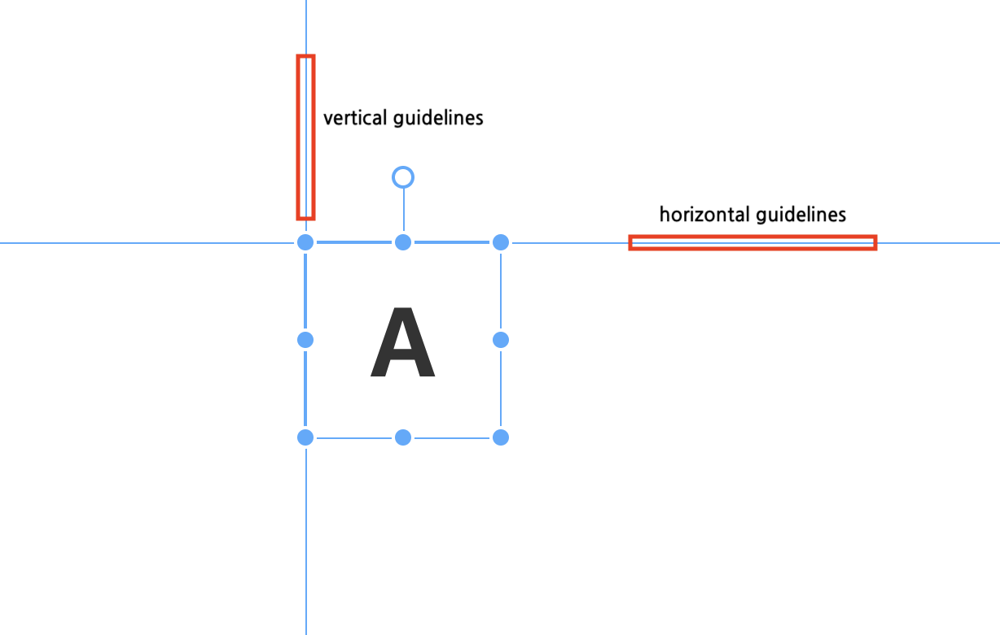
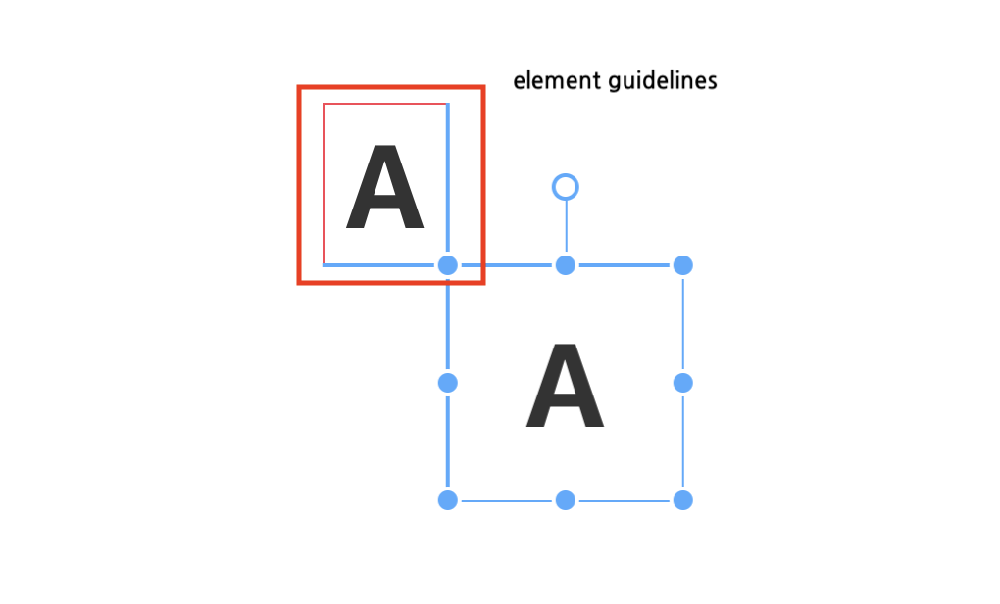

# Moveable Handbook

This document explains how to use [moveable](https://github.com/daybrush/moveable).

# Table of Contents
* [API Documentation](https://daybrush.com/moveable/release/latest/doc/)
* [Introduction](#toc-introduction)
* [Basic Support](#toc-support)
* [Events](#toc-events)
* [Ables](#toc-ables)
    * [Draggable](#toc-draggable)
    * [Resizable](#toc-resizable)
    * [Scalable](#toc-scalable)
    * [Rotatable](#toc-rotatable)
    * [Warpable](#toc-warpable)
    * [Pinchable](#toc-pinchable)
    * [Snappable(Guidelines & Boundaries)](#toc-snappable)
    * [Scrollable](#toc-scrollable)
* [How to use Group](#toc-group)
* [Group with Draggable](#toc-group-draggable)
* [Group with Resizable](#toc-group-resizable)
* [Group with Scalable](#toc-group-scalable)
* [Group with Rotatable](#toc-group-rotatable)
* [When the event starts while changing the target](#toc-change-target)
* [How to use custom css](#toc-custom-css)
    * [Show Partial ControlBox](#toc-directions)
    * [Set className](#toc-classname)
    * [Use important](#toc-important)
    * [Moveable's Default CSS](#toc-defaultcss)


# <a id="toc-introduction"></a>Introduction

<p align="middle" ></p>
<h2 align="middle">Moveable</h2>

Moveable makes the target draggable, resizable, scalable, warpable, rotatable, pinchable and snappable.

The reason for creating a moveable is to create an editor. Main Project is **[scenejs-editor](https://github.com/daybrush/scena)**.


Another reason for this is the [transform](https://developer.mozilla.org/en-US/docs/Web/CSS/transform).

If the transform overlaps from the root element to the parent element, the distance it moves is not equal to the amount actually moved. So I made it to calculate the distance actually moved.


# <a id="toc-support"></a>Basic Support

* Support Major Browsers
* Support SVG Elements (Not Support Resizable, Use scaleable instead of resizable.)
* Support 3d Transform
* [Support Group](#toc-group)


If you have any questions or requests or want to contribute to `moveable` or other packages, please write the [issue](https://github.com/daybrush/moveable/issues) or give me a Pull Request freely.

# <a id="toc-events"></a> Events

All events in moveable have the following properties by default:

* **currentTarget**: An instance of Moveable that occur an event.
* **target**: The target of the event where the MouseEvent or TouchEvent occurred.
* **clientX**: The x coordinate where the MouseEvent or TouchEvent occurred.
* **clientY**: The y coordinate where the MouseEvent or TouchEvent occurred.
* **datas**: Information can be shared between the same event. (ex: `dragStart`, `drag`, `dragEnd`)
* **inputEvent**: MouseEvent or TouchEvent source where the event occurred.
```ts
export interface OnEvent {
    currentTarget: MoveableInterface;
    target: HTMLElement | SVGElement;
    clientX: number;
    clientY: number;
    datas: IObject<any>;
    inputEvent: any;
}
```

# <a id="toc-ables"></a>Ables
You can Drag, Resize, Scale, Rotate, Warp, Pinch, Snap.

* [Draggable](#toc-draggable)
* [Resizable](#toc-resizable)
* [Scalable](#toc-scalable)
* [Rotatable](#toc-rotatable)
* [Warpable](#toc-warpable)
* [Pinchable](#toc-pinchable)
* [Snappable(Guidelines & Boundaries)](#toc-snappable)

## <a id="toc-draggable"></a>Draggable

<p align="center"></a>


**Draggable** refers to the ability to drag and move targets.

### Events
* [onDragStart](https://daybrush.com/moveable/release/latest/doc/Moveable.html#.event:dragStart): When the drag starts, the dragStart event is called.
* [onDrag](https://daybrush.com/moveable/release/latest/doc/Moveable.html#.event:drag): When dragging, the drag event is called.
* [onDragEnd](https://daybrush.com/moveable/release/latest/doc/Moveable.html#.event:dragEnd): When the drag finishes, the dragEnd event is called.

### Options
* [throttleDrag](https://daybrush.com/moveable/release/latest/doc/Moveable.html#throttleDrag): throttle of x, y when drag. (default: 0)
* [throttleDragRotate](https://daybrush.com/moveable/release/latest/doc/Moveable.html#throttleDragRotate): throttle of angle of x, y when drag. (default: 0)
* [dragArea](https://daybrush.com/moveable/release/latest/doc/Moveable.html#dragArea): Add an event to the moveable area instead of the target for stopPropagation. (default: false)

### Vanilla Example

```ts
import Moveable from "moveable";

const moveable = new Moveable(document.body, {
    // If you want to use a group, set multiple targets(type: Array<HTMLElement | SVGElement>).
    target: targets,
    draggable: true,
    throttleDrag: 0,
    throttleDragRotate: 0,
});

const frame = {
    translate: [0, 0],
};
moveable.on("dragStart", e => {
    e.set(frame.translate);
}).on("drag", e => {
    frame.translate = e.beforeTranslate;
    e.target.style.transform
        = `translate(${e.beforeTranslate[0]}px, ${e.beforeTranslate[1]}px)`;
}).on("dragEnd", e => {
    console.log("onDragEnd", e.target, e.isDrag);
});
```

### React & Preact Example


```tsx
import Moveable from "react-moveable"; // preact-moveable

this.frame = {
    translate: [0, 0],
};
<Moveable
    target={document.querySelector(".target")}
    draggable={true}
    throttleDrag={0}
    onDragStart={({ set }) => {
        set(frame.translate);
    }}
    onDrag={({ target, beforeTranslate }) => {
        frame.translate = beforeTranslate;
        target.style.transform
            = `translate(${beforeTranslate[0]}px, ${beforeTranslate[1]}px)`;
    }}
    onDragEnd={({ target, isDrag, clientX, clientY }) => {
        console.log("onDragEnd", target, isDrag);
    }} />;
```


### Angular Example
```ts
import {
    NgxMoveableModule,
    NgxMoveableComponent,
} from "ngx-moveable";

@Component({
    selector: 'AppComponent',
    template: `
<div #target class="target">target</div>
<ngx-moveable
    [target]="target"
    [draggable]="true"
    [throttleDrag]="0"
    (dragStart)="onDragStart($event)"
    (drag)="onDrag($event)"
    (dragEnd)="onDragEnd($event)"
    />
`,
})
export class AppComponent {
    frame = {
        translate: [0, 0],
    };
    onDragStart({ set }) {
        set(this.frame.translate);
    }
    onDrag({ target, beforeTranslate }) {
        this.frame.translate = beforeTranslate;
        target.style.transform
            = `translate(${beforeTranslate[0]}px, ${beforeTranslate[1]}px)`;
    }
    onDragEnd({ target, isDrag, clientX, clientY }) {
        console.log("onDragEnd", target, isDrag);
    }
}
```

### Svelte Example
```html
<script>
    import Moveable from "svelte-moveable";

    const frame = {
        translate: [0, 0],
    };
    let target;
</script>
```
```jsx
<div class="target" bind:this={target}>Target</div>
<Moveable
    draggable={true}
    target={target}
    throttleDrag={0}
    on:dragStart={({ detail: { set } }) => {
        set(frame.translate)
    }}
    on:drag={({ detail: { target, beforeTranslate }}) => {
        frame.translate = beforeTranslate;
        target.style.transform
            = `translate(${beforeTranslate[0]}px, ${beforeTranslate[1]}px)`;
    }}
    on:dragEnd={({ detail: { target, isDrag, clientX, clientY }}) => {
        console.log("onDragEnd", target, isDrag);
    }}
/>
```


## <a id="toc-resizable"></a>Resizable

<p align="center"></a>

**Resizable** indicates whether the target's width and height can be increased or decreased.


### Events
* [onReiszeStart](https://daybrush.com/moveable/release/latest/doc/Moveable.html#.event:resizeStart): When the resize starts, the resizeStart event is called.
* [onResize](https://daybrush.com/moveable/release/latest/doc/Moveable.html#.event:resize): When resizing, the resize event is called.
* [onResizeEnd](https://daybrush.com/moveable/release/latest/doc/Moveable.html#.event:resizeEnd): When the resize finishes, the resizeEnd event is called.


### Options
* [throttleResize](https://daybrush.com/moveable/release/latest/doc/Moveable.html#throttleResize): throttle of width, height when resize. (default: 0)
* [keepRatio](https://daybrush.com/moveable/release/latest/doc/Moveable.html#keepRatio): When resize or scale, keeps a ratio of the width, height. (default: false)
* [baseDirection](https://daybrush.com/moveable/release/latest/doc/Moveable.html#baseDirection): Target's base direcition using top, left, right, bottom (top: -1, left: -1, right: 1, bottom: 1) (default: [-1, -1])


### Vanilla Example

```ts
import Moveable from "moveable";

const moveable = new Moveable(document.body, {
    target: document.querySelector(".target"),
    scalable: true,
    throttleScale: 0,
    keepRatio: false,
});

const frame = {
    translate: [0, 0],
};
moveable.on("resizeStart", e => {
    // Set origin if transform-origin use %.
    e.setOrigin(["%", "%"]);

    // If cssSize and offsetSize are different, set cssSize. (no box-sizing)
    const style = window.getComputedStyle(e.target);
    const cssWidth = parseFloat(style.width);
    const cssHeight = parseFloat(style.height);
    e.set([cssWidth, cssHeight]);

    // If a drag event has already occurred, there is no dragStart.
    dragStart && dragStart.set(frame.translate);
}).on("resize", e => {
    e.target.style.width = `${e.width}px`;
    e.target.style.height = `${e.height}px`;

    // get drag event
    frame.translate = e.drag.beforeTranslate;
    e.target.style.transform
        = `translate(${e.drag.beforeTranslate[0]}px, ${e.drag.beforeTranslate[1]}px)`;
}).on("resizeEnd", e => {
    console.log("onResizeEnd", e.target, e.isDrag);
});
```

### React & Preact Example

```tsx
import Moveable from "react-moveable"; // preact-moveable

this.frame = {
    translate: [0, 0],
};
<Moveable
    target={document.querySelector(".target")}
    resizable={true}
    throttleResize={0}
    keepRatio={false}
    onResizeStart={({ target, set, setOrigin, dragStart }) => {
        // Set origin if transform-origin use %.
        setOrigin(["%", "%"]);

        // If cssSize and offsetSize are different, set cssSize. (no box-sizing)
        const style = window.getComputedStyle(target);
        const cssWidth = parseFloat(style.width);
        const cssHeight = parseFloat(style.height);
        set([cssWidth, cssHeight]);

        // If a drag event has already occurred, there is no dragStart.
        dragStart && dragStart.set(this.frame.translate);
    }}
    onResize={({ target, width, height, drag }) => {
        target.style.width = `${width}px`;
        target.style.height = `${height}px`;

        // get drag event
        this.frame.translate = drag.beforeTranslate;
        target.style.transform
            = `translate(${drag.beforeTranslate[0]}px, ${drag.beforeTranslate[1]}px)`;
    }}
    onResizeEnd={({ target, isDrag, clientX, clientY }) => {
        console.log("onResizeEnd", target, isDrag);
    }} />;
```


### Angular Example
```ts
import {
    NgxMoveableModule,
    NgxMoveableComponent,
} from "ngx-moveable";

@Component({
    selector: 'AppComponent',
    template: `
<div #target class="target">target</div>
<ngx-moveable
    [target]="target"
    [resizable]="true"
    [throttleResize]="0"
    [keepRatio]="false"
    (resizeStart)="onResizeStart($event)"
    (resize)="onResize($event)"
    (resizeEnd)="onResizeEnd($event)"
    />
`,
})
export class AppComponent {
    frame = {
        translate: [0, 0],
    };
    onResizeStart({ target, set, setOrigin, dragStart }) {
        // Set origin if transform-origin use %.
        setOrigin(["%", "%"]);

        // If cssSize and offsetSize are different, set cssSize. (no box-sizing)
        const style = window.getComputedStyle(target);
        const cssWidth = parseFloat(style.width);
        const cssHeight = parseFloat(style.height);
        set([cssWidth, cssHeight]);

        // If a drag event has already occurred, there is no dragStart.
        dragStart && dragStart.set(this.frame.translate);
    }
    onResize({ target, width, height, drag }) {
        target.style.width = `${width}px`;
        target.style.height = `${height}px`;

        // get drag event
        this.frame.translate = drag.beforeTranslate;
        target.style.transform
            = `translate(${drag.beforeTranslate[0]}px, ${drag.beforeTranslate[1]}px)`;
    }
    onResizeEnd({ target, isDrag, clientX, clientY }) {
        console.log("onResizeEnd", target, isDrag);
    }
}
```


### Svelte Example
```html
<script>
    import Moveable from "svelte-moveable";

    const frame = {
        translate: [0, 0],
    };
    let target;
</script>
```
```jsx
<div class="target" bind:this={target}>Target</div>
<Moveable
    target={target}
    resizable={true}
    throttleResize={0}
    on:resizeStart={({ detail: {target, set, setOrigin, dragStart }}) => {
        // Set origin if transform-origin use %.
        setOrigin(["%", "%"]);

        // If cssSize and offsetSize are different, set cssSize. (no box-sizing)
        const style = window.getComputedStyle(target);
        const cssWidth = parseFloat(style.width);
        const cssHeight = parseFloat(style.height);
        set([cssWidth, cssHeight]);

        // If a drag event has already occurred, there is no dragStart.
        dragStart && dragStart.set(frame.translate);
    }}
    on:resize={({ detail: { target, width, height, drag }}) => {
        target.style.width = `${width}px`;
        target.style.height = `${height}px`;

        // get drag event
        frame.translate = drag.beforeTranslate;
        target.style.transform
            = `translate(${drag.beforeTranslate[0]}px, ${drag.beforeTranslate[1]}px)`;
    }}
    on:resizeEnd={({ detail: { target, isDrag, clientX, clientY }}) => {
        console.log("onResizeEnd", target, isDrag);
    }}
/>
```

## <a id="toc-scalable"></a>Scalable
<p align="center"></a>

**Scalable** indicates whether the target's x and y can be scale of transform.

### Events
* [onScaleStart](https://daybrush.com/moveable/release/latest/doc/Moveable.html#.event:dragStart): When the scale starts, the scaleStart event is called.
* [onScale](https://daybrush.com/moveable/release/latest/doc/Moveable.html#.event:drag): When scaling, the scale event is called.
* [onScaleEnd](https://daybrush.com/moveable/release/latest/doc/Moveable.html#.event:dragEnd): When the scale finishes, the scaleEnd event is called.

### Options
* [throttleScale](https://daybrush.com/moveable/release/latest/doc/Moveable.html#throttleScale): throttle of scaleX, scaleY when scale. (default: 0)
* [keepRatio](https://daybrush.com/moveable/release/latest/doc/Moveable.html#keepRatio): When resize or scale, keeps a ratio of the width, height. (default: false)


### Vanilla Example

```ts
import Moveable from "moveable";

const moveable = new Moveable(document.body, {
    target: document.querySelector(".target"),
    scalable: true,
    throttleScale: 0,
    keepRatio: false,
});

const frame = {
    translate: [0, 0],
    scale: [1, 1],
};
moveable.on("scaleStart", ({ set, dragStart }) => {
    set(frame.scale);

    // If a drag event has already occurred, there is no dragStart.
    dragStart && dragStart.set(frame.translate);
}).on("scale", ({ target, scale, drag }) => {
    frame.scale = scale;
    // get drag event
    frame.translate = drag.beforeTranslate;
    target.style.transform
        = `translate(${drag.beforeTranslate[0]}px, ${drag.beforeTranslate[1]}px)`
        + `scale(${scale[0]}, ${scale[1]})`;
}).on("scaleEnd", ({ target, isDrag, clientX, clientY }) => {
    console.log("onScaleEnd", target, isDrag);
});
```

### React & Preact Example

```tsx
import Moveable from "react-moveable"; // preact-moveable

this.frame = {
    translate: [0, 0],
    scale: [1, 1],
};
<Moveable
    target={document.querySelector(".target")}
    scalable={true}
    throttleScale={0}
    keepRatio={false}
    onScaleStart={({ set, dragStart }) => {
        set(this.frame.scale);

        // If a drag event has already occurred, there is no dragStart.
        dragStart && dragStart.set(this.frame.translate);
    }}
    onScale={({ target, scale, drag }) => {
        this.frame.scale = scale;
        // get drag event
        this.frame.translate = drag.beforeTranslate;
        target.style.transform
            = `translate(${drag.beforeTranslate[0]}px, ${drag.beforeTranslate[1]}px)`
            + `scale(${scale[0]}, ${scale[1]})`;
    }}
    onScaleEnd={({ target, isDrag, clientX, clientY }) => {
        console.log("onScaleEnd", target, isDrag);
    }} />;
```


### Angular Example
```ts
import {
    NgxMoveableModule,
    NgxMoveableComponent,
} from "ngx-moveable";

@Component({
    selector: 'AppComponent',
    template: `
<div #target class="target">target</div>
<ngx-moveable
    [target]="target"
    [scalable]="true"
    [throttleScale]="0"
    [keepRatio]="false"
    (scaleStart)="onScaleStart($event)"
    (scale)="onScale($event)"
    (scaleEnd)="onScaleEnd($event)"
    />
`,
})
export class AppComponent {
    frame = {
        translate: [0, 0],
        scale: [1, 1],
    };
    onScaleStart({ set, dragStart }) {
        set(this.frame.scale);

        // If a drag event has already occurred, there is no dragStart.
        dragStart && dragStart.set(frame.translate);
    }
    onScale({ target, scale, drag }) {
        this.frame.scale = scale;
        // get drag event
        this.frame.translate = drag.beforeTranslate;
        target.style.transform
            = `translate(${drag.beforeTranslate[0]}px, ${drag.beforeTranslate[1]}px)`
            + `scale(${scale[0]}, ${scale[1]})`;
    }
    onScaleEnd({ target, isDrag, clientX, clientY }) {
        console.log("onScaleEnd", target, isDrag);
    }
}
```


### Svelte Example
```html
<script>
    import Moveable from "svelte-moveable";

    const frame = {
        translate: [0, 0],
        scale: [1, 1],
    };
    let target;
</script>
```
```jsx
<div class="target" bind:this={target}>Target</div>
<Moveable
    target={target}
    scalable={true}
    throttleScale={0}
    keepRatio={false}
    on:scaleStart={({ detail: { set, dragStart }}) => {
        set(frame.scale);

        // If a drag event has already occurred, there is no dragStart.
        dragStart && dragStart.set(this.frame.translate);
    }}
    on:scale={({ detail: { target, scale, drag }}) => {
        frame.scale = scale;
        // get drag event
        frame.translate = drag.beforeTranslate;
        target.style.transform
            = `translate(${drag.beforeTranslate[0]}px, ${drag.beforeTranslate[1]}px)`
            + `scale(${scale[0]}, ${scale[1]})`;
    }}
    on:scaleEnd={({ detail: { target, isDrag, clientX, clientY }}) => {
        console.log("onScaleEnd", target, isDrag);
    }}
/>
```

## <a id="toc-rotatable"></a>Rotatable
<p align="center"></a>

**Rotatable** indicates whether the target can be rotated.

### Events
* [onRotateStart](https://daybrush.com/moveable/release/latest/doc/Moveable.html#.event:rotateStart): When the rotate starts, the rotateStart event is called.
* [onRotate](https://daybrush.com/moveable/release/latest/doc/Moveable.html#.event:rotate): When rotating, the rotate event is called.
* [onRotateEnd](https://daybrush.com/moveable/release/latest/doc/Moveable.html#.event:rotateEnd): When the rotate finishes, the rotateEnd event is called.

### Options
* [throttleRotate](https://daybrush.com/moveable/release/latest/doc/Moveable.html#throttleRotate): throttle of angle(degree) when rotate. (default: 0)
* [rotationPosition](https://daybrush.com/moveable/release/latest/doc/Moveable.html#rotationPosition): You can specify the position of the rotation. (default: "top")


### Vanilla Example

```ts
import Moveable from "moveable";

const moveable = new Moveable(document.body, {
    target: document.querySelector(".target"),
    rotatable: true,
    throttleRotate: 0,
    rotationPosition: "top",
});

const frame = {
    rotate: 0,
};
moveable.on("rotateStart", ({ set }) => {
    set(frame.rotate);
}).on("rotate", ({ target, beforeRotate }) => {
    frame.rotate = beforeRotate;
    target.style.transform = `rotate(${beforeRotate}deg)`;
}).on("rotateEnd", ({ target, isDrag, clientX, clientY }) => {
    console.log("onRotateEnd", target, isDrag);
});
```

### React & Preact Example

```tsx
import Moveable from "react-moveable"; // preact-moveable

this.frame = {
    rotate: 0,
};
<Moveable
    target={document.querySelector(".target")}
    rotatable={true}
    throttleRotate={0}
    rotationPosition="top"
    onRotateStart={({ set }) => {
        set(this.frame.rotate);
    }}
    onRotate={({ target, beforeRotate }) => {
        this.frame.rotate = beforeRotate;
        target.style.transform = `rotate(${beforeRotate}deg)`;
    }}
    onRotateEnd={({ target, isDrag, clientX, clientY }) => {
        console.log("onRotateEnd", target, isDrag);
    }} />;
```

### Angular Example
```ts
import {
    NgxMoveableModule,
    NgxMoveableComponent,
} from "ngx-moveable";

@Component({
    selector: 'AppComponent',
    template: `
<div #target class="target">target</div>
<ngx-moveable
    [target]="target"
    [rotatable]="true"
    [throttleRotate]="0"
    rotationPosition="top"
    (rotateStart)="onRotateStart($event)"
    (rotate)="onRotate($event)"
    (rotateEnd)="onRotateEnd($event)"
    />
`,
})
export class AppComponent {
    frame = {
        rotate: 0,
    };
    onRotateStart({ set }) {
        set(this.frame.rotate);
    }
    onRotate({ target, beforeRotate }) {
        this.frame.rotate = beforeRotate;
        target.style.transform = `rotate(${beforeRotate}deg)`;
    }
    onRotateEnd({ target, isDrag, clientX, clientY }) {
        console.log("onRotateEnd", target, isDrag);
    }
}
```


### Svelte Example
```html
<script>
    import Moveable from "svelte-moveable";

    const frame = {
        rotate: 0,
    };
    let target;
</script>
```
```jsx
<div class="target" bind:this={target}>Target</div>
<Moveable
    target={target}
    rotatable={true}
    throttleRotate={0}
    rotationPosition="top"
    on:rotateStart={({ detail: { set }}) => {
        set(frame.rotate);
    }}
    on:rotate={({ detail: { target, beforeRotate }}) => {
        frame.rotate = beforeRotate;
        target.style.transform = `rotate(${beforeRotate}deg)`;
    }}
    on:rotateEnd={({ detail: { target, isDrag, clientX, clientY }}) => {
        console.log("onRotateEnd", target, isDrag);
    }}
/>
```

## <a id="toc-warpable"></a>Warpable

<p align="center"></a>


**Warpable** indicates whether the target can be warped(distorted, bented).

### Events
* [onWarpStart](https://daybrush.com/moveable/release/latest/doc/Moveable.html#.event:warpStart): When the warp starts, the warpStart event is called.
* [onWarp](https://daybrush.com/moveable/release/latest/doc/Moveable.html#.event:warp): When warping, the warp event is called.
* [onWarpEnd](https://daybrush.com/moveable/release/latest/doc/Moveable.html#.event:warpEnd): When the warp finishes, the warpEnd event is called.

### Vanilla Example


```ts
import Moveable from "moveable";

const moveable = new Moveable(document.body, {
    target: document.querySelector(".target"),
    warpable: true,
});

let warpMatrix = [
    1, 0, 0, 0,
    0, 1, 0, 0,
    0, 0, 1, 0,
    0, 0, 0, 1,
];

moveable.on("warpStart", ({ set }) => {
    set(warpMatrix);
}).on("warp", ({ target, matrix, transform }) => {
    warpMatrix = matrix;

    // target.style.transform = transform;
    target.style.transform = `matrix3d(${matrix.join(",")})`;
}).on("warpEnd", ({ target, isDrag, clientX, clientY }) => {
    console.log("onWarpEnd", target, isDrag);
});
```

### React & Preact Example

```tsx
import Moveable from "react-moveable"; // preact-moveable

this.warpMatrix = [
    1, 0, 0, 0,
    0, 1, 0, 0,
    0, 0, 1, 0,
    0, 0, 0, 1,
];
<Moveable
    target={document.querySelector(".target")}
    warpable={true}
    onWarpStart={({ set }) => {
        set(this.matrix);
    }}
    onWarp={({ target, matrix, transform }) => {
        warpMatrix = matrix;

        // target.style.transform = transform;
        target.style.transform = `matrix3d(${matrix.join(",")})`;
    }}
    onWarpEnd={({ target, isDrag, clientX, clientY }) => {
        console.log("onWarpEnd", target, isDrag);
    }} />;
```

### Angular Example
```ts
import {
    NgxMoveableModule,
    NgxMoveableComponent,
} from "ngx-moveable";

@Component({
    selector: 'AppComponent',
    template: `
<div #target class="target">target</div>
<ngx-moveable
    [target]="target"
    [warpable]="true"
    (warpStart)="onWarpStart($event)"
    (warp)="onWarp($event)"
    (warpEnd)="onWarpEnd($event)"
    />
`,
})
export class AppComponent {
    warpMatrix = [
        1, 0, 0, 0,
        0, 1, 0, 0,
        0, 0, 1, 0,
        0, 0, 0, 1,
    ];
    onWarpStart({ set }) {
        set(this.matrix);
    }
    onWarp({ target, matrix, transform }) {
        warpMatrix = matrix;

        // target.style.transform = transform;
        target.style.transform = `matrix3d(${matrix.join(",")})`;
    }
    onWarpEnd({ target, isDrag, clientX, clientY }) {
        console.log("onWarpEnd", target, isDrag);
    }
}
```
### Svelte Example
```html
<script>
    import Moveable from "svelte-moveable";

    const warpMatrix = [
        1, 0, 0, 0,
        0, 1, 0, 0,
        0, 0, 1, 0,
        0, 0, 0, 1,
    ];
    let target;
</script>
```
```jsx
<div class="target" bind:this={target}>Target</div>
<Moveable
    target={target}
    warpable={true}
    on:warpStart={({ detail: { set }}) => {
        set(warpMatrix);
    }}
    on:warp={({ detail: { target, matrix, transform }}) => {
        warpMatrix = matrix;

        // target.style.transform = transform;
        target.style.transform = `matrix3d(${matrix.join(",")})`;
    }}
    on:warpEnd={({ detail: { target, isDrag, clientX, clientY }}) => {
        console.log("onWarpEnd", target, isDrag);
    }}
/>
```

## <a id="toc-pinchable"></a>Pinchable

<p align="center"></a>

**Pinchable** indicates whether the target can be pinched with draggable, resizable, scalable, rotatable.

### Events
* [onPinchStart](https://daybrush.com/moveable/release/latest/doc/Moveable.html#.event:pinchStart): When the pinch starts, the pinchStart event is called with part of scaleStart, rotateStart, resizeStart
* [onPinch](https://daybrush.com/moveable/release/latest/doc/Moveable.html#.event:pinch): When pinching, the pinch event is called with part of scale, rotate, resize
* [onPinchEnd](https://daybrush.com/moveable/release/latest/doc/Moveable.html#.event:pinchEnd): When the pinch finishes, the pinchEnd event is called.

### Options
* [pinchThreshold](https://daybrush.com/moveable/release/latest/doc/Moveable.html#pinchThreshold): Minimum distance to pinch. (default: 20)
### Vanilla Example

```ts
const moveable = new Moveable(document.body, {
    target: document.querySelector(".target"),
    pinchable: true,
    draggable: true,
    resizable: true,
    pinchThreshold: 20,
});
```

### React & Preact Example

```tsx
import Moveable from "react-moveable"; // preact-moveable

<Moveable
    target={document.querySelector(".target")}
    pinchable={true}
    draggable={true}
    resizable={true
    pinchThreshold={20} />
```


### Angular Example
```ts
import {
    NgxMoveableModule,
    NgxMoveableComponent,
} from "ngx-moveable";

@Component({
    selector: 'AppComponent',
    template: `
<div #target class="target">target</div>
<ngx-moveable
    [target]="target"
    [pinchable]="true"
    [draggable]="true"
    [resizable]="true"
    [pinchThreshold]="20"

    />
`,
})
export class AppComponent {

}
```

### Svelte Example
```html
<script>
    import Moveable from "svelte-moveable";

    let target;
</script>
```
```jsx
<div class="target" bind:this={target}>Target</div>
<Moveable
    target={target}
    pinchable={true}
    draggable={true}
    resizable={true}
    pinchThreshold={20} />
```


## <a id="toc-snappable"></a>Snappable(Guidelines & Boundaries)

<p align="center"></a>

**Snappable** indicates whether to snap to the guidelines.

### Options
* [bounds](https://daybrush.com/moveable/release/latest/doc/Moveable.html#bounds): You can set up boundaries. (default: null)
* [snapThreshold](https://daybrush.com/moveable/release/latest/doc/Moveable.html#snapThreshold): Distance value that can snap to guidelines. (default: 5)
* [snapCenter](https://daybrush.com/moveable/release/latest/doc/Moveable.html#snapCenter): When you drag, make the snap in the center of the target. (default: false)
* [horizontalGuidelines](https://daybrush.com/moveable/release/latest/doc/Moveable.html#horizontalGuidelines): Add guidelines in the horizontal direction. (default: [])
* [verticalGuidelines](https://daybrush.com/moveable/release/latest/doc/Moveable.html#verticalGuidelines): Add guidelines in the vertical direction. (default: [])




* [elementGuidelines](https://daybrush.com/moveable/release/latest/doc/Moveable.html#elementGuidelines)
Add guidelines for the element.




### Vanilla Example

```ts
const moveable = new Moveable(document.body, {
    target: document.querySelector(".target"),
    snappable: true,
    snapThreshold: 5,
    snapCenter: false,
    bounds: { left: 0, top: 0, bottom: 1000, right: 1000 },
    verticalGuidelines: [100, 200, 300],
    horizontalGuidelines: [0, 100, 200],
    elementGuidelines: [document.querySelector(".element")],
});
```

### React & Preact Example

```tsx
import Moveable from "react-moveable"; // preact-moveable

<Moveable
    target={document.querySelector(".target")}
    snappable={true}
    snapThreshold={5}
    snapCenter={false}
    bounds={{ left: 0, top: 0, bottom: 1000, right: 1000 }}
    verticalGuidelines={[100, 200, 300]}
    horizontalGuidelines={[0, 100, 200]}
    elementGuidelines={[document.querySelector(".element")]} />
```


### Angular Example
```ts
import {
    NgxMoveableModule,
    NgxMoveableComponent,
} from "ngx-moveable";

@Component({
    selector: 'AppComponent',
    template: `
<div #target class="target">target</div>
<ngx-moveable
    [target]="target"
    [snappable]="true"
    [bounds]="bounds"
    [snapCenter]="false"
    [verticalGuidelines]="verticalGuidelines"
    [horizontalGuidelines]="horizontalGuidelines"
    [elementGuidelines]="elementGuidelines"
    />
`,
})
export class AppComponent {
    bounds = { left: 0, top: 0, bottom: 1000, right: 1000 };
    verticalGuidelines = [100, 200, 300];
    horizontalGuidelines = [0, 100, 200];
    elementGuidelines = [document.querySelector(".element")];
}
```

### Svelte Example
```html
<script>
    import Moveable from "svelte-moveable";

    let target;
    let element;
</script>
```
```jsx
<div class="target" bind:this={target}>Target</div>
<div class="target" bind:this={element}>elementGuideline</div>
<Moveable
    target={target}
    snappable={true}
    snapThreshold={5}
    snapCenter={false}
    bounds={{ left: 0, top: 0, bottom: 1000, right: 1000 }}
    verticalGuidelines={[100, 200, 300]}
    horizontalGuidelines={[0, 100, 200]}
    elementGuidelines={[element]}  />
```

## <a id="toc-scrollable"></a>Scrollable

**Scrollable** indicates whether or not target can be scrolled to the scroll container (default: false)

### Events
* [onScroll](https://daybrush.com/moveable/release/latest/doc/Moveable.html#.event:scroll): When the drag cursor leaves the scrollContainer, the `scroll` event occur to scroll.
* [onScrollGroup](https://daybrush.com/moveable/release/latest/doc/Moveable.html#.event:scrollGroup): When the drag cursor leaves the scrollContainer, the `scrollGroup` event occur to scroll in group.

### Options
* [scrollContainer](https://daybrush.com/moveable/release/latest/doc/Moveable.html#scrollContainer): The container to which scroll is applied (default: container)
* [scrollThreshold](https://daybrush.com/moveable/release/latest/doc/Moveable.html#scrollThreshold): Expand the range of the scroll check area. (default: 0)
* [getScrollPosition](https://daybrush.com/moveable/release/latest/doc/Moveable.html#getScrollPosition): Sets a function to get the scroll position. (default: Function)


### Vanilla Example

```ts
const moveable = new Moveable(document.body, {
    target: document.querySelector(".target"),
    scrollable: true,
    scrollContainer: document.body,
    scrollThreshold: 0,
    getScrollPosition: ({ scrollContainer }) => ([scrollContainer.scrollLeft, scrollContainer.scrollTop]),
}).on("scroll", ({ scrollContainer, direction }) => {
    scrollContainer.scrollLeft += direction[0] * 10;
    scrollContainer.scrollTop += direction[1] * 10;
}).on("scrollGroup", ({ scrollContainer, direction }) => {
    scrollContainer.scrollLeft += direction[0] * 10;
    scrollContainer.scrollTop += direction[1] * 10;
});
```

### React & Preact Example

```tsx
import Moveable from "react-moveable"; // preact-moveable

<Moveable
    target={document.querySelector(".target")}
    scrollable={true}
    container={document.body}
    scrollContainer={document.body}
    scrollThreshold={0}
    getScrollPosition={({ scrollContainer }) => ([scrollContainer.scrollLeft, scrollContainer.scrollTop])}
    onScroll={({ scrollContainer, direction }) => {
        scrollContainer.scrollLeft += direction[0] * 10;
        scrollContainer.scrollTop += direction[1] * 10;
    }}
    onScrollGroup={({ scrollContainer, direction }) => {
        scrollContainer.scrollLeft += direction[0] * 10;
        scrollContainer.scrollTop += direction[1] * 10;
    }}
    />
```


### Angular Example
```ts
import {
    NgxMoveableModule,
    NgxMoveableComponent,
} from "ngx-moveable";

@Component({
    selector: 'AppComponent',
    template: `
<div #target class="target">target</div>
<ngx-moveable
    [target]="target"
    [container]="container"
    [scrollable]="true"
    [scrollContainer]="container"
    [scrollThreshold]="0"
    [getScrollPosition]="getScrollPosition"
    (scroll)="onScroll($event)"
    (scrollGroup)="onScroll($event)"
    />
`,
})
export class AppComponent {
    container = document.body;
    getScrollPosition({ scrollContainer }) {
        return [scrollContainer.scrollLeft, scrollContainer.scrollTop];
    }
    onScroll({ scrollContainer, direction }) {
        scrollContainer.scrollLeft += direction[0] * 10;
        scrollContainer.scrollTop += direction[1] * 10;
    }
}
```


### Svelte Example
```html
<script>
    import Moveable from "svelte-moveable";

    let target;
</script>
```
```jsx
<div class="target" bind:this={target}>Target</div>
<Moveable
    target={target}
    scrollable={true}
    container={document.body}
    scrollContainer={document.body}
    scrollThreshold={0}
    getScrollPosition={({ scrollContainer }) => ([scrollContainer.scrollLeft, scrollContainer.scrollTop])}
    on:scroll={({ detail: { scrollContainer, direction }}) => {
        scrollContainer.scrollLeft += direction[0] * 10;
        scrollContainer.scrollTop += direction[1] * 10;
    }}
    on:scrollGroup={({ detail: { scrollContainer, direction }}) => {
        scrollContainer.scrollLeft += direction[0] * 10;
        scrollContainer.scrollTop += direction[1] * 10;
    }}
    />
```

# <a id="toc-group"></a> How to use Group

**Groupable** indicates Whether the targets can be moved in group with draggable, resizable, scalable, rotatable.

If you want to use a group, set multiple targets(type: Array<HTMLElement | SVGElement>).

When using group, event name changes. (ex: dragStart => dragGroupStart, pinchStart => pinchGroupStart)

The drag event always occurs with the group event.(Resizable, Scalable, Rotatable)

In a group, Pinchable and Snappable are the same as they used to be. But warpable is not available.

## How to use Group with ables
* [**draggable**](#toc-group-draggable)
* [**resizable**](#toc-group-resizable)
* [**scalable**](#toc-group-scalable)
* [**rotatable**](#toc-group-rotatable)

## <a id="toc-group-draggable"></a>Group with Draggable

### Events
* [onDragGroupStart](https://daybrush.com/moveable/release/latest/doc/Moveable.html#.event:dragGroupStart): When the group drag starts, the `dragGroupStart` event is called.
* [onDragGroup](https://daybrush.com/moveable/release/latest/doc/Moveable.html#.event:dragGroup): When the group drag, the `dragGroup` event is called.
* [onDragGroupEnd](https://daybrush.com/moveable/release/latest/doc/Moveable.html#.event:dragGroupEnd): When the group drag finishes, the `dragGroupEnd` event is called.


### Vanilla Example

```ts
import Moveable from "moveable";

const targets = [].slice.call(document.querySelectorAll(".target"));
const moveable = new Moveable(document.body, {
    // If you want to use a group, set multiple targets(type: Array<HTMLElement | SVGElement>).
    target: targets,
    draggable: true,
});

const frames = targets.map(() => ({
    translate: [0, 0],
}));
moveable.on("dragGroupStart", ({ events }) => {
    events.forEach((ev, i) => {
        const frame = frames[i];
        ev.set(frame.translate);
    });
}).on("dragGroup", ({ targets, events }) => {
    events.forEach(({ target, beforeTranslate }, i) => {
        const frame = frames[i];

        frame.translate = beforeTranslate;
        target.style.transform
            = `translate(${beforeTranslate[0]}px, ${beforeTranslate[1]}px)`;
    });
}).on("dragGroupEnd", ({ targets, isDrag, clientX, clientY }) => {
    console.log("onDragGroupEnd", targets, isDrag);
});
```

### React & Preact Example


```tsx
import Moveable from "react-moveable"; // preact-moveable

this.targets = [].slice.call(document.querySelectorAll(".target"));
this.frames = targets.map(() => ({
    translate: [0, 0],
}));

<Moveable
    target={this.targets}
    draggable={true}
    onDragGroupStart={({ events }) => {
        events.forEach((ev, i) => {
            const frame = this.frames[i];
            ev.set(frame.translate);
        });
    }}
    onDragGroup={({ targets, events }) => {
        events.forEach(({ target, beforeTranslate }, i) => {
            const frame = this.frames[i];

            frame.translate = beforeTranslate;
            target.style.transform
                = `translate(${beforeTranslate[0]}px, ${beforeTranslate[1]}px)`;
        });
    }}
    onDragGroupEnd={({ targets, isDrag, clientX, clientY }) => {
        console.log("onDragGroupEnd", targets, isDrag);
    }} />
```


### Angular Example
```ts
import { OnInit } from "@angular/core";
import {
    NgxMoveableModule,
    NgxMoveableComponent,
} from "ngx-moveable";

@Component({
    selector: 'AppComponent',
    template: `
<div class="target target1">target1</div>
<div class="target target2">target2</div>
<div class="target target3">target3</div>
<ngx-moveable
    [target]="targets"
    [draggable]="true"
    (dragGroupStart)="onDragGroupStart($event)"
    (dragGroup)="onDragGroup($event)"
    (dragGroupEnd)="onDragGroupEnd($event)"
    />
`,
})
export class AppComponent implements OnInit {
    targets = [];
    frames = [];
    ngOnInit() {
        this.targets = [].slice.call(document.querySelectorAll(".target"));
        this.frames = targets.map(() => ({
            translate: [0, 0],
        }));
    }
    onDragGroupStart({ events }) {
        events.forEach((ev, i) => {
            const frame = this.frames[i];
            ev.set(frame.translate);
        });
    }
    onDragGroup({ targets, events }) {
        events.forEach(({ target, beforeTranslate }, i) => {
            const frame = this.frames[i];

            frame.translate = beforeTranslate;
            target.style.transform
                = `translate(${beforeTranslate[0]}px, ${beforeTranslate[1]}px)`;
        });
    }
    onDragGroupEnd({ targets, isDrag, clientX, clientY }) {
        console.log("onDragGroupEnd", targets, isDrag);
    }
}
```

### Svelte Example
```html
<script>
    import Moveable from "svelte-moveable";
    import { onMount } from "svelte";

    let targets = [];
    let frames = [];

    onMount(() => {
        targets = [].slice.call(document.querySelectorAll(".target"));
        frames = targets.map(() => ({
            translate: [0, 0],
        }));
    });
</script>
```
```jsx
<div class="target">Target1</div>
<div class="target">Target2</div>
<div class="target">Target3</div>
<Moveable
    target={targets}
    draggable={true}
    on:dragGroupStart={({ detail: { events }}) => {
        events.forEach((ev, i) => {
            const frame = frames[i];
            ev.set(frame.translate);
        });
    }}
    on:dragGroup={({ detail: { targets, events }}) => {
        events.forEach(({ target, beforeTranslate }, i) => {
            const frame = frames[i];

            frame.translate = beforeTranslate;
            target.style.transform
                = `translate(${beforeTranslate[0]}px, ${beforeTranslate[1]}px)`;
        });
    }}
    on:dragGroupEnd={({ detail: { targets, isDrag, clientX, clientY }}) => {
        console.log("onDragGroupEnd", targets, isDrag);
    }}
    />
```

## <a id="toc-group-resizable"></a>Group with Resizable
### Events
* [onReiszeGroupStart](https://daybrush.com/moveable/release/latest/doc/Moveable.html#.event:resizeGroupStart): When the group resize starts, the `resizeGroupStart` event is called.
* [onResizeGroup](https://daybrush.com/moveable/release/latest/doc/Moveable.html#.event:resizeGroup): When the group resize, the `resizeGroup` event is called.
* [onResizeGroupEnd](https://daybrush.com/moveable/release/latest/doc/Moveable.html#.event:resizeGroupEnd): When the group resize finishes, the `resizeGroupEnd` event is called.

### Vanilla Example
```ts
import Moveable from "moveable";

const targets = [].slice.call(document.querySelectorAll(".target"));
const moveable = new Moveable(document.body, {
    // If you want to use a group, set multiple targets(type: Array<HTMLElement | SVGElement>).
    target: targets,
    resizable: true,
});

const frames = targets.map(() => ({
    translate: [0, 0],
}));
moveable.on("resizeGroupStart", ({ events }) => {
    events.forEach((ev, i) => {
        const frame = frames[i];

        // Set origin if transform-origin use %.
        ev.setOrigin(["%", "%"]);

        // If cssSize and offsetSize are different, set cssSize.
        const style = window.getComputedStyle(ev.target);
        const cssWidth = parseFloat(style.width);
        const cssHeight = parseFloat(style.height);
        ev.set([cssWidth, cssHeight]);

        // If a drag event has already occurred, there is no dragStart.
        ev.dragStart && ev.dragStart.set(frame.translate);
    });
}).on("resizeGroup", ({ events }) => {
    events.forEach(({ target, width, height, drag }, i) => {
        const frame = frames[i];

        target.style.width = `${width}px`;
        target.style.height = `${height}px`;

        // get drag event
        frame.translate = drag.beforeTranslate;
        target.style.transform
            = `translate(${drag.beforeTranslate[0]}px, ${drag.beforeTranslate[1]}px)`;
    });
}).on("resizeGroupEnd", ({ targets, isDrag, clientX, clientY }) => {
    console.log("onResizeGroupEnd", targets, isDrag);
});
```

### React & Preact Example


```tsx
import Moveable from "react-moveable"; // preact-moveable

this.targets = [].slice.call(document.querySelectorAll(".target"));
this.frames = targets.map(() => ({
    translate: [0, 0],
}));

<Moveable
    target={this.targets}
    resizable={true}
    onResizeGroupStart={({ events }) => {
        events.forEach((ev, i) => {
            const frame = this.frames[i];

            // Set origin if transform-origin use %.
            ev.setOrigin(["%", "%"]);

            // If cssSize and offsetSize are different, set cssSize.
            const style = window.getComputedStyle(ev.target);
            const cssWidth = parseFloat(style.width);
            const cssHeight = parseFloat(style.height);
            ev.set([cssWidth, cssHeight]);

            // If a drag event has already occurred, there is no dragStart.
            ev.dragStart && ev.dragStart.set(frame.translate);
        });
    }}
    onResizeGroup={({ events }) => {
        events.forEach(({ target, width, height, drag }, i) => {
            const frame = this.frames[i];

            target.style.width = `${width}px`;
            target.style.height = `${height}px`;

            // get drag event
            frame.translate = drag.beforeTranslate;
            target.style.transform
                = `translate(${drag.beforeTranslate[0]}px, ${drag.beforeTranslate[1]}px)`;
        });
    }}
    onResizeGroupEnd={({ targets, isDrag, clientX, clientY }) => {
        console.log("onResizeGroupEnd", targets, isDrag);
    }} />
```


### Angular Example
```ts
import { OnInit } from "@angular/core";
import {
    NgxMoveableModule,
    NgxMoveableComponent,
} from "ngx-moveable";

@Component({
    selector: 'AppComponent',
    template: `
<div class="target target1">target1</div>
<div class="target target2">target2</div>
<div class="target target3">target3</div>
<ngx-moveable
    [target]="targets"
    [resizable]="true"
    (resizeGroupStart)="onResizeGroupStart($event)"
    (resizeGroup)="onResizeGroup($event)"
    (resizeGroupEnd)="onResizeGroupEnd($event)"
    />
`,
})
export class AppComponent implements OnInit {
    targets = [];
    frames = [];
    ngOnInit() {
        this.targets = [].slice.call(document.querySelectorAll(".target"));
        this.frames = targets.map(() => ({
            translate: [0, 0],
        }));
    }
    onResizeGroupStart({ events }) {
        events.forEach((ev, i) => {
            const frame = this.frames[i];

            // Set origin if transform-origin use %.
            ev.setOrigin(["%", "%"]);

            // If cssSize and offsetSize are different, set cssSize.
            const style = window.getComputedStyle(ev.target);
            const cssWidth = parseFloat(style.width);
            const cssHeight = parseFloat(style.height);
            ev.set([cssWidth, cssHeight]);

            // If a drag event has already occurred, there is no dragStart.
            ev.dragStart && ev.dragStart.set(frame.translate);
        });
    }
    onResizeGroup({ events }) {
        events.forEach(({ target, width, height, drag }, i) => {
            const frame = this.frames[i];

            target.style.width = `${width}px`;
            target.style.height = `${height}px`;

            // get drag event
            frame.translate = drag.beforeTranslate;
            target.style.transform
                = `translate(${drag.beforeTranslate[0]}px, ${drag.beforeTranslate[1]}px)`;
        });
    }
    onResizeGroupEnd({ targets, isDrag, clientX, clientY }) {
        console.log("onResizeGroupEnd", targets, isDrag);
    }
}
```

### Svelte Example
```html
<script>
    import Moveable from "svelte-moveable";
    import { onMount } from "svelte";

    let targets = [];
    let frames = [];

    onMount(() => {
        targets = [].slice.call(document.querySelectorAll(".target"));
        frames = targets.map(() => ({
            translate: [0, 0],
        }));
    });
</script>
```
```jsx
<div class="target">Target1</div>
<div class="target">Target2</div>
<div class="target">Target3</div>
<Moveable
    target={targets}
    resizable={true}
    on:resizeGroupStart={({ detail: { events }}) => {
        events.forEach((ev, i) => {
            const frame = frames[i];

            // Set origin if transform-origin use %.
            ev.setOrigin(["%", "%"]);

            // If cssSize and offsetSize are different, set cssSize.
            const style = window.getComputedStyle(ev.target);
            const cssWidth = parseFloat(style.width);
            const cssHeight = parseFloat(style.height);
            ev.set([cssWidth, cssHeight]);

            // If a drag event has already occurred, there is no dragStart.
            ev.dragStart && ev.dragStart.set(frame.translate);
        });
    }}
    on:resizeGroup={({ detail: { events }}) => {
        events.forEach(({ target, width, height, drag }, i) => {
            const frame = frames[i];

            target.style.width = `${width}px`;
            target.style.height = `${height}px`;

            // get drag event
            frame.translate = drag.beforeTranslate;
            target.style.transform
                = `translate(${drag.beforeTranslate[0]}px, ${drag.beforeTranslate[1]}px)`;
        });
    }}
    on:resizeGroupEnd={({ detail: { targets, isDrag, clientX, clientY }}) => {
        console.log("onResizeGroupEnd", targets, isDrag);
    }}
    />
```

## <a id="toc-group-scalable"></a>Group with Scalable

### Events
* [onScaleGroupStart](https://daybrush.com/moveable/release/latest/doc/Moveable.html#.event:scaleGroupStart)
* [onScaleGroup](https://daybrush.com/moveable/release/latest/doc/Moveable.html#.event:scaleGroup)
* [onScaleGroupEnd](https://daybrush.com/moveable/release/latest/doc/Moveable.html#.event:scaleGroupEnd)


### Vanilla Example
```ts
import Moveable from "moveable";

const targets = [].slice.call(document.querySelectorAll(".target"));
const moveable = new Moveable(document.body, {
    // If you want to use a group, set multiple targets(type: Array<HTMLElement | SVGElement>).
    target: targets,
    scalable: true,
});

const frames = targets.map(() => ({
    translate: [0, 0],
    scale: [1, 1],
}));
moveable.on("scaleGroupStart", ({ events }) => {
    events.forEach((ev, i) => {
        const frame = frames[i];

        ev.set(frame.scale);
        // If a drag event has already occurred, there is no dragStart.
        ev.dragStart && ev.dragStart.set(frame.translate);
    });
}).on("scaleGroup", ({ events }) => {
    events.forEach(({ target, scale, drag }, i) => {
        const frame = frames[i];

        frame.scale = scale;

        // get drag event
        frame.translate = drag.beforeTranslate;
        target.style.transform
            = `translate(${drag.beforeTranslate[0]}px, ${drag.beforeTranslate[1]}px) `
            + `scale(${scale[0]}, ${scale[1]})`;
    });
}).on("scaleGroupEnd", ({ targets, isDrag, clientX, clientY }) => {
    console.log("onScaleGroupEnd", targets, isDrag);
});
```

### React & Preact Example


```tsx
import Moveable from "react-moveable"; // preact-moveable

this.targets = [].slice.call(document.querySelectorAll(".target"));
this.frames = targets.map(() => ({
    translate: [0, 0],
    scale: [1, 1],
}));

<Moveable
    target={this.targets}
    scalable={true}
    onScaleGroupStart={({ events }) => {
        events.forEach((ev, i) => {
            const frame = this.frames[i];

            ev.set(frame.scale);
            // If a drag event has already occurred, there is no dragStart.
            ev.dragStart && ev.dragStart.set(frame.translate);
        });
    }}
    onScaleGroup={({ events }) => {
        events.forEach(({ target, scale, drag }, i) => {
            const frame = this.frames[i];

            frame.scale = scale;

            // get drag event
            frame.translate = drag.beforeTranslate;
            target.style.transform
                = `translate(${drag.beforeTranslate[0]}px, ${drag.beforeTranslate[1]}px) `
                + `scale(${scale[0]}, ${scale[1]})`;
        });
    }}
    onScaleGroupEnd={({ targets, isDrag, clientX, clientY }) => {
        console.log("onScaleGroupEnd", targets, isDrag);
    }} />
```


### Angular Example
```ts
import { OnInit } from "@angular/core";
import {
    NgxMoveableModule,
    NgxMoveableComponent,
} from "ngx-moveable";

@Component({
    selector: 'AppComponent',
    template: `
<div class="target target1">target1</div>
<div class="target target2">target2</div>
<div class="target target3">target3</div>
<ngx-moveable
    [target]="targets"
    [scalable]="true"
    (scaleGroupStart)="onScaleGroupStart($event)"
    (scaleGroup)="onScaleGroup($event)"
    (scaleGroupEnd)="onScaleGroupEnd($event)"
    />
`,
})
export class AppComponent implements OnInit {
    targets = [];
    frames = [];
    ngOnInit() {
        this.targets = [].slice.call(document.querySelectorAll(".target"));
        this.frames = targets.map(() => ({
            translate: [0, 0],
            scale: [1, 1],
        }));
    }
    onScaleGroupStart({ events }) {
        events.forEach((ev, i) => {
            const frame = this.frames[i];

            ev.set(frame.scale);
            // If a drag event has already occurred, there is no dragStart.
            ev.dragStart && ev.dragStart.set(frame.translate);
        });
    }
    onScaleGroup({ events }) {
        events.forEach(({ target, scale, drag }, i) => {
            const frame = this.frames[i];

            frame.scale = scale;

            // get drag event
            frame.translate = drag.beforeTranslate;
            target.style.transform
                = `translate(${drag.beforeTranslate[0]}px, ${drag.beforeTranslate[1]}px) `
                + `scale(${scale[0]}, ${scale[1]})`;
        });
    }
    onScaleGroupEnd({ targets, isDrag, clientX, clientY }) {
        console.log("onScaleGroupEnd", targets, isDrag);
    }
}
```

### Svelte Example
```html
<script>
    import Moveable from "svelte-moveable";
    import { onMount } from "svelte";

    let targets = [];
    let frames = [];

    onMount(() => {
        targets = [].slice.call(document.querySelectorAll(".target"));
        frames = targets.map(() => ({
            translate: [0, 0],
            scale: [1, 1],
        }));
    });
</script>
```
```jsx
<div class="target">Target1</div>
<div class="target">Target2</div>
<div class="target">Target3</div>
<Moveable
    target={targets}
    scalable={true}
    on:scaleGroupStart={({ detail: { events }}) => {
        events.forEach((ev, i) => {
            const frame = frames[i];

            ev.set(frame.scale);
            // If a drag event has already occurred, there is no dragStart.
            ev.dragStart && ev.dragStart.set(frame.translate);
        });
    }}
    on:scaleGroup={({ detail: { events }}) => {
        events.forEach(({ target, scale, drag }, i) => {
            const frame = frames[i];

            frame.scale = scale;

            // get drag event
            frame.translate = drag.beforeTranslate;
            target.style.transform
                = `translate(${drag.beforeTranslate[0]}px, ${drag.beforeTranslate[1]}px) `
                + `scale(${scale[0]}, ${scale[1]})`;
        });
    }}
    on:scaleGroupEnd={({ detail: { targets, isDrag, clientX, clientY }}) => {
        console.log("onScaleGroupEnd", targets, isDrag);
    }}
    />
```


## <a id="toc-group-rotatable"></a>Group with Rotatable
### Events
* [onRotateGroupStart](https://daybrush.com/moveable/release/latest/doc/Moveable.html#.event:rotateGroupStart)
* [onRotateGroup](https://daybrush.com/moveable/release/latest/doc/Moveable.html#.event:rotateGroup)
* [onRotateGroupEnd](https://daybrush.com/moveable/release/latest/doc/Moveable.html#.event:rotateGroupEnd)


### Vanilla Example
```ts
import Moveable from "moveable";

const targets = [].slice.call(document.querySelectorAll(".target"));
const moveable = new Moveable(document.body, {
    // If you want to use a group, set multiple targets(type: Array<HTMLElement | SVGElement>).
    target: targets,
    rotatable: true,
});

const frames = targets.map(() => ({
    translate: [0, 0],
    rotate: 0,
}));
moveable.on("rotateGroupStart", ({ events }) => {
    events.forEach((ev, i) => {
        const frame = frames[i];

        ev.set(frame.rotate);
        // If a drag event has already occurred, there is no dragStart.
        ev.dragStart && ev.dragStart.set(frame.translate);
    });
}).on("rotateGroup", ({ events }) => {
    events.forEach(({ target, beforeRotate, drag }, i) => {
        const frame = frames[i];

        frame.rotate = beforeRotate;

        // get drag event
        frame.translate = drag.beforeTranslate;
        target.style.transform
            = `translate(${drag.beforeTranslate[0]}px, ${drag.beforeTranslate[1]}px) `
            + `rotate(${beforeRotate}deg)`;
    });
}).on("rotateGroupEnd", ({ targets, isDrag, clientX, clientY }) => {
    console.log("onRotateGroupEnd", targets, isDrag);
});
```

### React & Preact Example


```tsx
import Moveable from "react-moveable"; // preact-moveable

this.targets = [].slice.call(document.querySelectorAll(".target"));
this.frames = targets.map(() => ({
    translate: [0, 0],
    rotate: 0,
}));

<Moveable
    target={this.targets}
    rotatable={true}
    onRotateGroupStart={({ events }) => {
        events.forEach((ev, i) => {
            const frame = this.frames[i];

            ev.set(frame.rotate);
            // If a drag event has already occurred, there is no dragStart.
            ev.dragStart && ev.dragStart.set(frame.translate);
        });
    }}
    onRotateGroup={({ events }) => {
        events.forEach(({ target, beforeRotate, drag }, i) => {
            const frame = this.frames[i];

            frame.rotate = beforeRotate;

            // get drag event
            frame.translate = drag.beforeTranslate;
            target.style.transform
                = `translate(${drag.beforeTranslate[0]}px, ${drag.beforeTranslate[1]}px) `
                + `rotate(${beforeRotate}deg)`;
        });
    }}
    onRotateGroupEnd={({ targets, isDrag, clientX, clientY }) => {
        console.log("onRotateGroupEnd", targets, isDrag);
    }} />
```


### Angular Example
```ts
import { OnInit } from "@angular/core";
import {
    NgxMoveableModule,
    NgxMoveableComponent,
} from "ngx-moveable";

@Component({
    selector: 'AppComponent',
    template: `
<div class="target target1">target1</div>
<div class="target target2">target2</div>
<div class="target target3">target3</div>
<ngx-moveable
    [target]="targets"
    [rotatable]="true"
    (rotateGroupStart)="onRotateGroupStart($event)"
    (rotateGroup)="onRotateGroup($event)"
    (rotateroupEnd)="onRotateGroupEnd($event)"
    />
`,
})
export class AppComponent implements OnInit {
    targets = [];
    frames = [];
    ngOnInit() {
        this.targets = [].slice.call(document.querySelectorAll(".target"));
        this.frames = targets.map(() => ({
            translate: [0, 0],
            rotate: 0,
        }));
    }
    onRotateGroupStart({ events }) => {
        events.forEach((ev, i) => {
            const frame = this.frames[i];

            ev.set(frame.rotate);
            // If a drag event has already occurred, there is no dragStart.
            ev.dragStart && ev.dragStart.set(frame.translate);
        });
    }
    onRotateGroup({ events }) {
        events.forEach(({ target, beforeRotate, drag }, i) => {
            const frame = this.frames[i];

            frame.rotate = beforeRotate;

            // get drag event
            frame.translate = drag.beforeTranslate;
            target.style.transform
                = `translate(${drag.beforeTranslate[0]}px, ${drag.beforeTranslate[1]}px) `
                + `rotate(${beforeRotate}deg)`;
        });
    }
    onRotateGroupEnd({ targets, isDrag, clientX, clientY }) {
        console.log("onRotateGroupEnd", targets, isDrag);
    }
}
```


### Svelte Example
```html
<script>
    import Moveable from "svelte-moveable";
    import { onMount } from "svelte";

    let targets = [];
    let frames = [];

    onMount(() => {
        targets = [].slice.call(document.querySelectorAll(".target"));
        frames = targets.map(() => ({
            translate: [0, 0],
            rotate: 0,
        }));
    });
</script>
```
```jsx
<div class="target">Target1</div>
<div class="target">Target2</div>
<div class="target">Target3</div>
<Moveable
    target={targets}
    rotatable={true}
    on:rotateGroupStart={({ detail: { events }}) => {
        events.forEach((ev, i) => {
            const frame = frames[i];

            ev.set(frame.rotate);
            // If a drag event has already occurred, there is no dragStart.
            ev.dragStart && ev.dragStart.set(frame.translate);
        });
    }}
    on:rotateGroup={({ detail: { events }}) => {
        events.forEach(({ target, beforeRotate, drag }, i) => {
            const frame = frames[i];

            frame.rotate = beforeRotate;

            // get drag event
            frame.translate = drag.beforeTranslate;
            target.style.transform
                = `translate(${drag.beforeTranslate[0]}px, ${drag.beforeTranslate[1]}px) `
                + `rotate(${beforeRotate}deg)`;
        });
    }}
    on:rotateGroupEnd={({ detail: { targets, isDrag, clientX, clientY }}) => {
        console.log("onRotateGroupEnd", targets, isDrag);
    }}
    />
```


# <a id="toc-change-target></a> When the event starts while changing the target

### methods
* [dragStart](https://daybrush.com/moveable/release/latest/doc/Moveable.html#dragStart): You can drag start the Moveable through the external `MouseEvent`or `TouchEvent`. (Angular: ngDragStart)
* [setState](https://daybrush.com/moveable/release/latest/doc/Moveable.html#setState): You can change options or properties dynamically.

### Vanilla Exmaple
```js
import Moveable from "moveable";


const moveable = new Moveable(document.body, {
    target: document.querySelector(".target1");
});

window.addEventListener("mousedown", e => {
    moveable.setState({
        target: e.target,
    }, () => {
        moveable.dragStart(e);
    });
});
```

### React, Preact Example
```tsx
import Moveable from "react-moveable"; // preact-moveable

<div onMouseDown={onMouseDown}></div>
<Moveable ref={e => { this.moveable = e; }} target={this.state.target} />

onMouseDown(e) {
    // Use nativeEvent if you are using react event handling
    const nativeEvent = e.nativeEvent

    this.setState({
        target: nativeEvent.target,
    }, () => {
        this.moveable.dragStart(nativeEvent);
    });
}
```

### Angular Example
```tsx

@Component({
    selector: 'AppComponent',
    template: `
<div (mousedown)="onMouseDown($event)">
    <div class="target">target</div>
    <div class="target">target2</div>
</div>
<ngx-moveable
    #moveable
    [target]="target"
    />
`,
})
export class AppComponent {
    targert = null;
    @ViewChild('moveable', { static: false })  moveable;
    onMouseDown(e) {
        this.target = e.target;
        setTimeout(() => {
            this.moveable.ngDragStart(e);
        });
    }
}
```

### Svelte Example
```html
<script>
    import Moveable from "svelte-moveable";
    import { onMount } from "svelte";

    let moveable;
    let target;

    function nonMouseDown(e) {
        target = e.target;

        setTimeout(() => {
            moveable.dragStart(e);
        });
    }
</script>
```
```jsx
<div class="target" on:mousedown={onMouseDown}>Target1</div>
<div class="target" on:mousedown={onMouseDown}>Target2</div>
<div class="target" on:mousedown={onMouseDown}>Target3</div>
<Moveable
    bind:this={moveable}
    target={target}
    />
```


# <a id="toc-custom-css"></a>✨ How to use custom CSS


## <a id="toc-directions"></a>Show Partial Control Box
### Options
* [renderDirections](https://daybrush.com/moveable/release/latest/doc/Moveable.html#.event:renderDirections) : Set directions to show the control box. (default: ["n", "nw", "ne", "s", "se", "sw", "e", "w"])

### Vanilla Example
```ts
import Moveable from "moveable";

const moveable = new Moveable(document.body, {
    renderDirections: ["n", "nw", "ne", "s", "se", "sw", "e", "w"],
});

moveable.renderDirections = ["nw", "ne", "sw", "se"];
```

## <a id="toc-classname"></a>Set className
### Options
* [className](https://daybrush.com/moveable/release/latest/doc/Moveable.html#.event:className) : You can specify the className of the moveable controlbox. (default: "")

### Vanilla Example
```ts
import Moveable from "moveable";

const moveable = new Moveable(document.body, {
    className: "moveable1",
});

moveable.classname = "moveable2";
```

## <a id="toc-important"></a>Use important
* If you want to custom CSS, use **`!important`**.

```css
.moveable-control {
    width: 20px!important;
    height: 20px!important;
    margin-top: -10px!important;
    margin-left: -10px!important;
}
```

## <a id="toc-defaultcss"></a>Moveable's Default CSS
### moveable-line

```css
.moveable-line {
    position: absolute;
    width: 1px;
    height: 1px;
    background: #4af;
    transform-origin: 0px 0.5px;
}
```


```css
.moveable-line.moveable-rotation-line {
    height: 40px;
    width: 1px;
    transform-origin: 0.5px 39.5px;
}
```
### moveable-control

```css
.moveable-control {
    position: absolute;
    width: 14px;
    height: 14px;
    border-radius: 50%;
    border: 2px solid #fff;
    box-sizing: border-box;
    background: #4af;
    margin-top: -7px;
    margin-left: -7px;
    z-index: 10;
}
```


### moveable-rotataion

```css
/* moveable-rotation */
.moveable-line.moveable-rotation-line .moveable-control {
    border-color: #4af;
    background:#fff;
    cursor: alias;
}
```

### moveable-origin
```css
.moveable-control.moveable-origin {
    border-color: #f55;
    background: #fff;
    width: 12px;
    height: 12px;
    margin-top: -6px;
    margin-left: -6px;
    pointer-events: none;
}
```

### moveable-direction

```css
.moveable-direction.moveable-e, .moveable-direction.moveable-w {
    cursor: ew-resize;
}
.moveable-direction.moveable-s, .moveable-direction.moveable-n {
    cursor: ns-resize;
}
.moveable-direction.moveable-nw, .moveable-direction.moveable-se, .moveable-reverse .moveable-direction.moveable-ne, .moveable-reverse .moveable-direction.moveable-sw {
    cursor: nwse-resize;
}
.moveable-direction.moveable-ne, .moveable-direction.moveable-sw, .rCSckyn7i.moveable-reverse .moveable-direction.moveable-nw, moveable-reverse .moveable-direction.moveable-se {
    cursor: nesw-resize;
}
```


### Default CSS

* `rCS4nn8ek` is The hash value of the class name, which can be changed at any time.
* All classes have a prefix of `moveable-`.
```css
.rCS4nn8ek {
	position: fixed;
	width: 0;
	height: 0;
	left: 0;
	top: 0;
	z-index: 3000;
}
.rCS4nn8ek .moveable-control-box{
    z-index: 0;
}
.rCS4nn8ek .moveable-line, .rCS4nn8ek .moveable-control{
	left: 0;
    top: 0;
    will-change: transform;
}
.rCS4nn8ek .moveable-control{
	position: absolute;
	width: 14px;
	height: 14px;
	border-radius: 50%;
	border: 2px solid #fff;
	box-sizing: border-box;
	background: #4af;
	margin-top: -7px;
    margin-left: -7px;
    z-index: 10;
}
.rCS4nn8ek .moveable-line{
	position: absolute;
	width: 1px;
	height: 1px;
	background: #4af;
	transform-origin: 0px 0.5px;
}
.rCS4nn8ek .moveable-line.moveable-dashed{
    box-sizing: border-box;
    background: transparent;
}
.rCS4nn8ek .moveable-line.moveable-dashed.moveable-horizontal{
    border-top: 1px dashed #4af;
}
.rCS4nn8ek .moveable-line.moveable-dashed.moveable-vertical{
    border-left: 1px dashed #4af;
}
.rCS4nn8ek .moveable-line.moveable-dashed:before{
    position: absolute;
    content: attr(data-size);
    color: #4af;
    font-size: 12px;
    font-weight: bold;
}
.rCS4nn8ek .moveable-line.moveable-dashed.moveable-horizontal:before{
    left: 50%;
    transform: translateX(-50%);
    bottom: 5px;
}
.rCS4nn8ek .moveable-line.moveable-dashed.moveable-vertical:before{
    top: 50%;
    transform: translateY(-50%);
    left: 5px;
}
.rCS4nn8ek .moveable-line.moveable-rotation-line{
	height: 40px;
	width: 1px;
    transform-origin: 0.5px 39.5px;
    top: -40px;
}
.rCS4nn8ek .moveable-line.moveable-rotation-line .moveable-control{
	border-color: #4af;
	background:#fff;
	cursor: alias;
}
.rCS4nn8ek .moveable-line.moveable-vertical{
    transform: translateX(-50%);
}
.rCS4nn8ek .moveable-line.moveable-horizontal{
    transform: translateY(-50%);
}
.rCS4nn8ek .moveable-line.moveable-vertical.moveable-bold{
    width: 2px;
}
.rCS4nn8ek .moveable-line.moveable-horizontal.moveable-bold{
    height: 2px;
}
.rCS4nn8ek .moveable-control.moveable-origin{
	border-color: #f55;
	background: #fff;
	width: 12px;
	height: 12px;
	margin-top: -6px;
	margin-left: -6px;
	pointer-events: none;
}
.rCS4nn8ek .moveable-group{
    z-index: -1;
}
.rCS4nn8ek .moveable-area{
    position: absolute;
}
.rCS4nn8ek .moveable-area-pieces{
    position: absolute;
    top: 0;
    left: 0;
    display: none;
}
.rCS4nn8ek .moveable-area.moveable-avoid{
    pointer-events: none;
}
.rCS4nn8ek .moveable-area.moveable-avoid+.moveable-area-pieces{
    display: block;
}
.rCS4nn8ek .moveable-area-piece{
    position: absolute;
}


```
